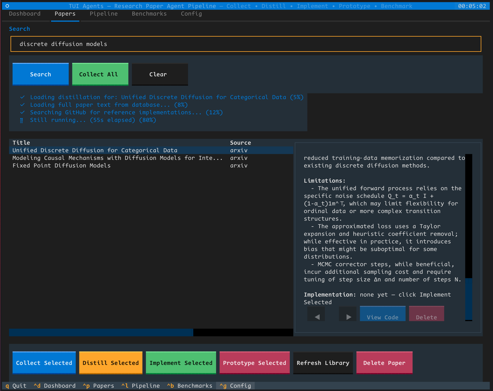

# TUI Research agents - Terminal based research agents

Prototype TUI application to manage the workflow:
- Search \& collect papers
- Summarizing and distilling papers with ChromaDB
- Generate multiple implementations
- Prototyping and benchmarking these implementations (not implemented)
